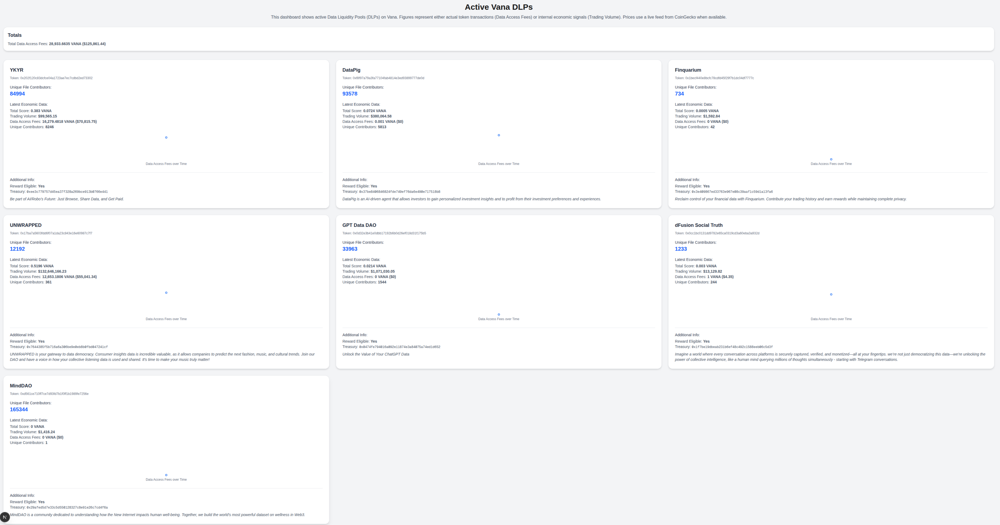

This is a [Next.js](https://nextjs.org) project bootstrapped with [`create-next-app`](https://nextjs.org/docs/app/api-reference/cli/create-next-app).

## Introduction

This project provides a simple dashboard for tracking DLP performance to allow users to see how their DLPs are performing compared to other DLPs and to choose which DLPs to invest in.

The subgraph schema published by Vana is still evolving and so some data points such as Total Score andn Trading Volume should be ignored since they are internal values that it's unclear what they represent. For exmple, a data DAO could have a score of 0, 1 contributor and no fees and no trading volume on Data Dex and still have a high trading score value. As the subgraph is updated and finalised then these figures will become more clear and useful.

The most useful figure is Data Access Fees since this represents the fees generated by that pool. Fees are driven by market use of the data and that is the most valuable metric for determining adoption and value of a pools data.

Each DLP has a chart showing fees over time but since there's only a single data point right now then we only see that. Over time we should see more points and start to show a graph.




## Getting Started

First, run the development server:

```bash
npm run dev
# or
yarn dev
# or
pnpm dev
# or
bun dev
```

Open [http://localhost:3000](http://localhost:3000) with your browser to see the result.

You can start editing the page by modifying `app/page.tsx`. The page auto-updates as you edit the file.

This project uses [`next/font`](https://nextjs.org/docs/app/building-your-application/optimizing/fonts) to automatically optimize and load [Geist](https://vercel.com/font), a new font family for Vercel.

## Learn More

To learn more about Next.js, take a look at the following resources:

- [Next.js Documentation](https://nextjs.org/docs) - learn about Next.js features and API.
- [Learn Next.js](https://nextjs.org/learn) - an interactive Next.js tutorial.

You can check out [the Next.js GitHub repository](https://github.com/vercel/next.js) - your feedback and contributions are welcome!

## Deploy on Vercel

The easiest way to deploy your Next.js app is to use the [Vercel Platform](https://vercel.com/new?utm_medium=default-template&filter=next.js&utm_source=create-next-app&utm_campaign=create-next-app-readme) from the creators of Next.js.

Check out our [Next.js deployment documentation](https://nextjs.org/docs/app/building-your-application/deploying) for more details.
